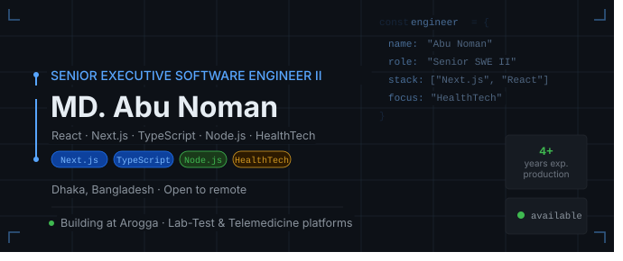

<div align="center">

<!-- Cover Banner — export the SVG from the chat above and upload to your repo as `banner.svg`, then reference it here -->
<!-- Replace the URL below with your actual uploaded banner image path -->


# 👋 Hi, I'm MD. Abu Noman

### Senior Executive Software Engineer II

**React · Next.js · TypeScript · Node.js · HealthTech**

[](mailto:md.abunoman1997@gmail.com)
[](https://www.linkedin.com/in/md-abu-noman-994a631b0/)
[](https://github.com/abu-noman30)
[](mailto:md.abunoman1997@gmail.com)

</div>

---

## About Me

Software Engineer with **4+ years of experience** building scalable, high-performance web applications.

I'm currently building real-world health-tech platforms at **Arogga** — serving customers and healthcare professionals across a lab-test platform and a telemedicine system.

My engineering focus:

- ⚛️ Modern **React.js, Next.js & TypeScript** applications
- 🏗️ Scalable and maintainable **frontend architecture**
- 🚀 **Core Web Vitals** and page performance optimization
- 🔌 REST API integration and third-party services
- 📊 Data-driven, accessible, and responsive UIs
- 🔍 SSR, SSG, ISR and modern rendering strategies
- 🧩 Reusable component systems that reduce development time

---

## 💼 Experience

### 🏥 Arogga — Senior Executive Software Engineer II *(Current)*

**Products:**

| Platform | Description |
|---|---|
| 🧪 Lab-Test Platform | End-to-end lab test booking and result experience |
| 👨‍⚕️ Telemedicine System | Doctor consultation platform for patients |
| 📊 Diagnostic Admin Dashboard | Role-based admin tooling for operations |

**Key contributions:**

- Developed scalable frontend features with React, Next.js and TypeScript
- Implemented SSR, SSG, CSR and modern Next.js App Router patterns
- Built reusable UI components — reduced UI development time by ~35%
- Improved frontend performance and Core Web Vitals scores
- Integrated **Google Analytics, Mixpanel and Meta Pixel**
- Developed role-based admin functionality
- Collaborated with backend engineers on REST API integration
- Worked within Agile cross-functional teams

---

## 🛠️ Tech Stack

### Frontend


### Backend & Databases


### Tools & Platforms


---

## ⭐ Featured Projects

### 🛒 E-Commerce Platform
A modern e-commerce application focused on performance, responsive UI, and product discovery.

**Stack:** React · Next.js · TypeScript · Tailwind CSS · REST API

[View Project](#) · [Source Code](#)

---

### 🏥 Healthcare Platform
A healthcare web application providing users access to medical services and digital health experiences.

**Stack:** Next.js · React · TypeScript · Tailwind CSS · REST API

[View Project](#) · [Source Code](#)

---

### 📊 Admin Dashboard
A role-based dashboard for managing business operations, users, and data workflows.

**Stack:** React · Node.js · Express · MySQL · REST API

[View Project](#) · [Source Code](#)

---

## 📈 GitHub Stats

<div align="center">


</div>

<div align="center">


</div>

<!--
---

## 📊 Contribution Activity
<div align="center">
  RECOMMENDED PERMANENT FIX — Self-host via GitHub Actions (free, never breaks):

  1. In your profile repo (abu-noman30/abu-noman30), create:
     .github/workflows/snake.yml

  2. Paste this content into snake.yml:

     name: Generate Snake
     on:
       schedule:
         - cron: "0 0 * * *"
       workflow_dispatch:
     jobs:
       generate:
         runs-on: ubuntu-latest
         steps:
           - uses: Platane/snk@v3
             with:
               github_user_name: ${{ github.repository_owner }}
               outputs: |
                 dist/snake.svg
                 dist/snake-dark.svg?palette=github-dark
           - uses: crazy-max/ghaction-github-pages@v3
             with:
               target_branch: output
               build_dir: dist
             env:
               GITHUB_TOKEN: ${{ secrets.GITHUB_TOKEN }}

  3. Go to Settings → Actions → General → set Workflow permissions to "Read and write"
  4. Run it once manually from the Actions tab
  5. Then replace the  below with the <picture> block shown below it
-->

<!-- STEP 5 — replace the img below with this once the workflow has run once:
<picture>
  <source media="(prefers-color-scheme: dark)" srcset="https://raw.githubusercontent.com/abu-noman30/abu-noman30/output/snake-dark.svg" />
  <source media="(prefers-color-scheme: light)" srcset="https://raw.githubusercontent.com/abu-noman30/abu-noman30/output/snake.svg" />
  
</picture>
-->

<!-- Current fallback — replace with the <picture> block above after setup -->
<!--  -->

<!-- </div> -->

---

## ✍️ I Write About

- ⚛️ React & Next.js patterns
- 📘 TypeScript in production
- 🚀 Web performance and Core Web Vitals
- 🏗️ Scalable frontend architecture
- 🔍 SEO and rendering strategies
- 🧩 Reusable component design
- 🤖 AI-assisted development workflows

---

## 🤝 Connect With Me

<div align="center">

[](mailto:md.abunoman1997@gmail.com)
[](https://www.linkedin.com/in/md-abu-noman-994a631b0/)
[](https://github.com/abu-noman30)

</div>

---

<div align="center">

```text
Currently         →   Building scalable health-tech web applications
Learning          →   Advanced Next.js App Router & system design
Open to           →   Remote software engineering opportunities
```

*Thanks for visiting — if something here resonates, let's connect.* ⭐

</div>
